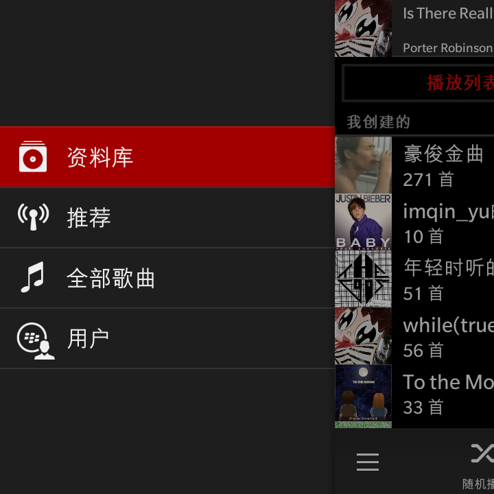
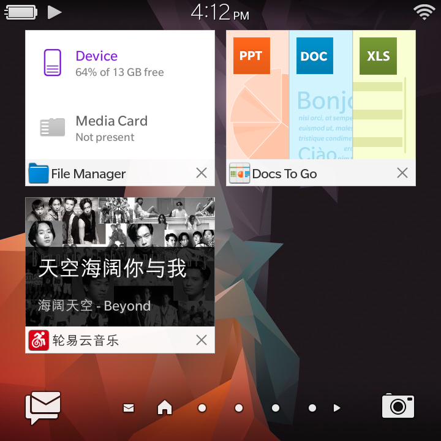
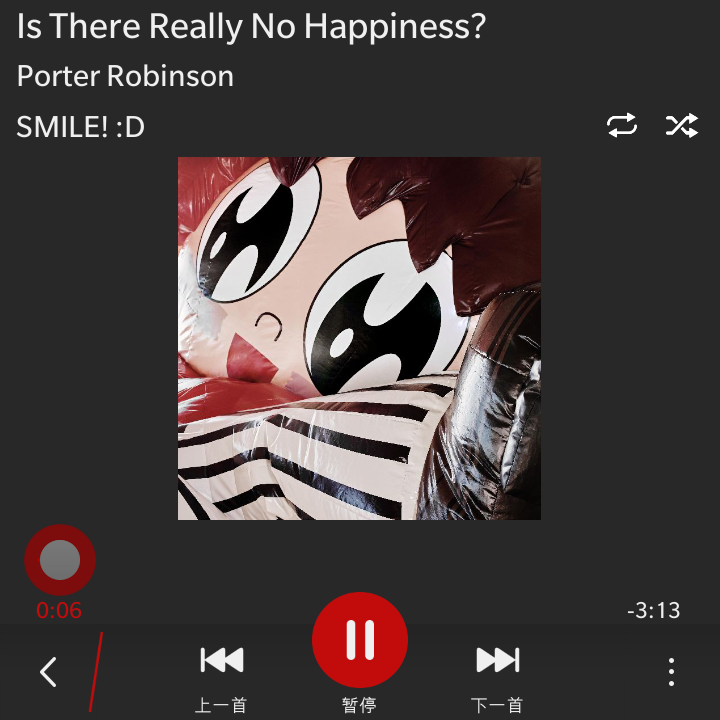
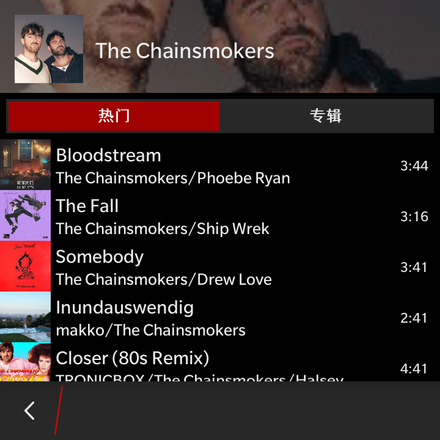
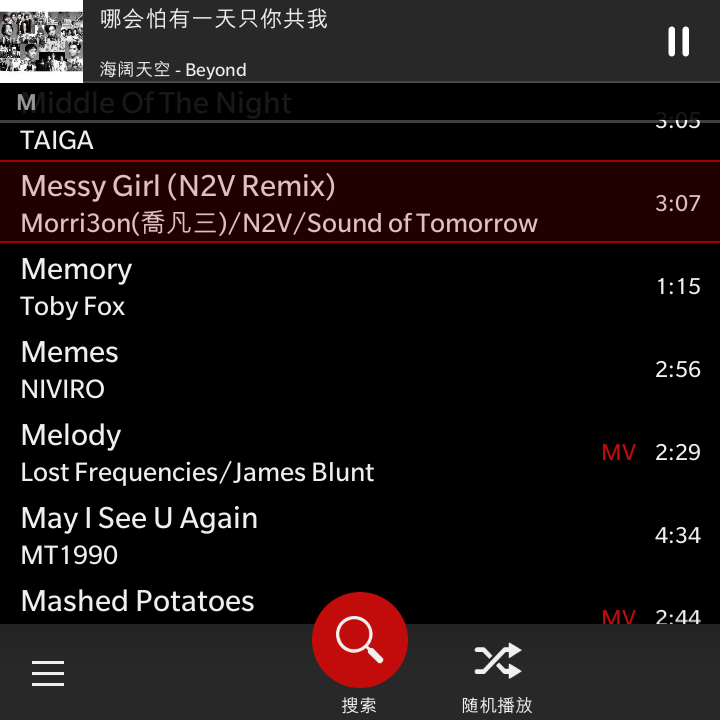
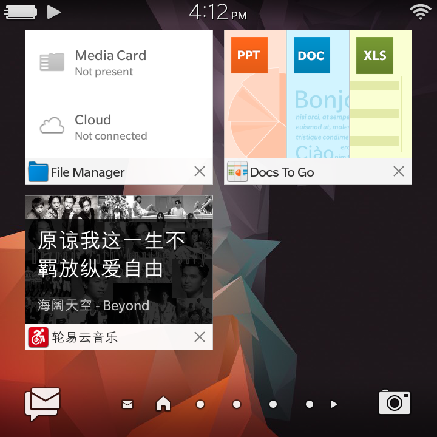
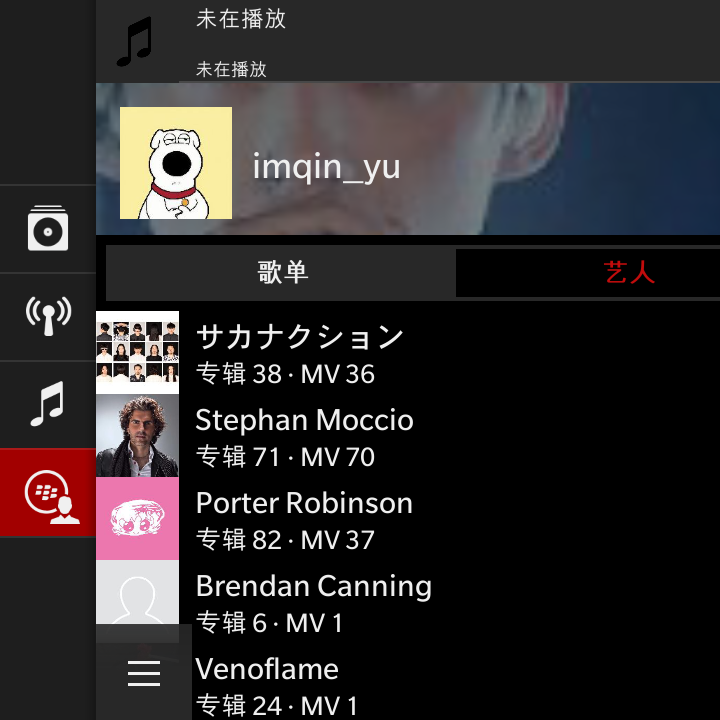

# 网易云音乐黑莓原生第三方：轮易云音乐

## 说明

基于黑莓 Cascade 框架，已在黑莓 Q20 和 Z10 测试

目前处于测试阶段，还有很多没有实现的功能和 bug

这是越狱软件，要安装请先将您的黑莓越狱

目前可以：

- 播放歌曲
- 载入歌单
- 搜索歌曲
- 本地缓存
- 载入关注艺人

图标灵感来源：[HomasWSC](https://space.bilibili.com/12722558)

仅供学习使用，禁止倒卖

欢迎加入 BlackberryPhonix QQ 交流群：892633534

## 软件截图

资料库

正在播放

艺人页

全部歌曲视图

最近任务

用户页

## 开发团队

- UI 原型 / QA：Fremantle
- 编程 / 界面实现：Hy4、Hy3、Deepseek V4.1、Kimi K3
- 图标设计：ChatGPT

## 鸣谢

排名不分先后

- Oleksandr：提供越狱漏洞和工具
- Pablo from WaitBerry：提供参考文档
- Github NeteaseCloudMusicApiEnhanced 项目：提供网易云接口
- Anwar Ludin、Davenson Lombard：提供免费的黑莓开发教程
- 以及所有支持我的 AI 朋友们
